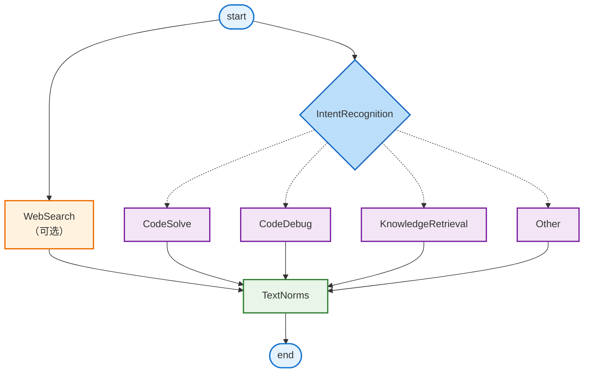

## KuiCoding

<p align="center">
  
</p>

KuiCoding 是一个基于 Spring Boot + LangChain4j + LangGraph4j 的多智能体代码助手。它将意图识别、代码生成/调试、知识检索与 Web 搜索串联成一个可编排的工作流，结合 Redis 会话记忆、PgVector 向量库与 Tavily Web 搜索，为开发者提供可扩展、可自定义的 AI 编程体验。

---

## 🚀 项目特性

- 多智能体编排：Intent、Code、Debug、Knowledge、Other、WebSearch 等 Agent 由 LangGraph4j 串联，自动路由用户意图
- LangChain4j 深度集成：统一管理大模型、流式输出、Chat Memory、RAG ContentRetriever
- **流式输出支持**：通过 `WorkflowService` 和 `TextualNormsNode` 实现实时流式响应，前端可实时接收 AI 生成内容
- Redis 会话记忆：通过自定义 `RedisChatMemoryStore` 持久化多轮对话上下文
- PgVector RAG：把 `src/main/resources/content` 内资料嵌入 PostgreSQL + pgvector，支持检索式回答
- 自动生成/验证代码：`CodeSolveNode` 同步生成测试用例、代码草案与验证报告
- Tavily Web 搜索：`OtherNode` 联合网络检索回答开放问题
- 可配置提示词：所有系统 Prompt 以 YAML 形式存放在 `src/main/resources/prompt`，支持热切换
- REST API：`/kui/chat` 以 JSON 发送消息，返回结构化意图和回复；`/stream/api/workflow` 支持流式输出
- 可扩展工作流：新增节点、 Agent 或数据源时只需在 Graph 中注册即可

---

## 🏗 项目结构

```
KUI/
├── pom.xml
├── README.md
├── docker指令.md
├── src/
│   ├── main/
│   │   ├── java/com/example/kui/
│   │   │   ├── KuiApplication.java             # Spring Boot 入口
│   │   │   ├── agents/                         # LangChain4j AI Service 定义
│   │   │   ├── common/dto|enums/               # API DTO & PromptKey
│   │   │   ├── config/                         # LangChain4j、Agent、WebSearch 配置
│   │   │   ├── controller/                     # REST 控制器
│   │   │   ├── graph/                          # LangGraph4j 工作流
│   │   │   │   ├── nodes/                      # 各智能体节点
│   │   │   │   ├── state/WorkflowState.java    # 状态定义
│   │   │   │   └── workflows/MainWorkflowGraph # 编排入口
│   │   │   ├── memory/RedisChatMemoryStore.java
│   │   │   ├── services/                       # 工作流执行服务
│   │   │   │   ├── GraphExecutionService.java
│   │   │   │   └── WorkflowService.java        # 流式输出服务
│   │   │   ├── streaming/                      # 流式输出模块
│   │   │   │   ├── WorkflowStreamObserver.java # 流式更新观察者接口
│   │   │   │   └── WorkflowStreamRegistry.java  # 观察者注册表
│   │   │   └── util/                           # Prompt/消息/线程池工具
│   │   └── resources/
│   │       ├── application.yml                 # 核心配置
│   │       ├── prompt/*.yml                    # Prompt 模板
│   │       └── content/                        # 预置知识库（XCPC 模板等）
│   └── test/java/com/example/kui/              # 单元测试入口
└── target/                                     # 构建产物
```

---

## 📁 模块说明

- `agents/`  
  基于 `@AiService` 的 LangChain4j Agent，分别负责意图识别 (`IntentAgent`)、代码生成验证 (`CodeAgent`)、调试 (`DebugAgent`)、知识检索 (`KnowledgeAgent`)、通用聊天 (`OtherAgent`)、Web 搜索 (`WebSearchAgent`)。

- `config/`  
  - `AgentConfig`：配置 ChatMemory、Redis Memory Provider、PgVector EmbeddingStore、文档加载器。支持 `kui.content.auto-load-on-startup` 自动 ingest 文档。  
  - `LangChainConfig`：注册 `ChatModelListener` 记录请求/响应。  
  - `WebSearchConfig`：封装 Tavily WebSearchEngine 与 ContentRetriever。

- `graph/`  
  - `state/WorkflowState`：扩展 `MessagesState`，记录 `messages`、`threadId`、`intentRecognition`。  
  - `workflows/MainWorkflowGraph`：使用 LangGraph4j 构建状态图，从 `IntentRecognitionNode` 出发路由到 `CodeSolveNode` / `KnowledgeRetrievalNode` / `DebugNode` / `OtherNode`，最终汇聚到 `TextualNormsNode` 进行文本规范化。  
  - `nodes/*`：每个节点对应一个业务 Agent，并负责构造输入/输出。`TextualNormsNode` 负责流式生成最终回复。

- `memory/RedisChatMemoryStore`  
  实现 `ChatMemoryStore` 接口，将消息序列化存储到 Redis，支持多线程 ID 以及派生 memory (例如 `thread-test` / `thread-chat`)。

- `services/`  
  - `GraphExecutionService`：接收 `ChatRequest`，组装初始 `WorkflowState` 并运行工作流，返回 `ChatResponse`（包含最终回复、识别意图、线程 ID）。  
  - `WorkflowService`：提供流式输出功能，通过 `ResponseBodyEmitter` 实现实时推送，注册 `WorkflowStreamObserver` 接收 `TextualNormsNode` 的流式更新。

- `streaming/`  
  - `WorkflowStreamObserver`：流式更新观察者接口，定义 `onTextualUpdate(content, intent, end)` 方法。  
  - `WorkflowStreamRegistry`：线程安全的观察者注册表，以 `threadId` 为键管理多个会话的观察者。

- `controller/`  
  - `CodeController`：暴露 REST API：`/kui/chat`、`/kui/liuyan`（访客留言存 Redis）、`/kui/search`（直接调用 Web 搜索 Agent）。  
  - `WorkflowController`：暴露流式 API：`/stream/api/workflow`，返回 `application/x-ndjson` 格式的流式响应。

- `common/dto`  
  定义 `ChatRequest`（包含单条 `messages` 与 `threadId`）、`ChatResponse` 与 `WorkflowStreamChunk`（流式输出数据块，包含 stage、content、intent、threadId、end 等字段）。

- `util/`  
  - `PromptUtil`：按 `PromptKey` 载入 YAML 片段。  
  - `ChatMessageUtil`：解决 LangChain4j 模板中 `{{ }}` 转义问题。  
  - `ExecutorUtil`：提供共享线程池，用于 Code Agent 并发执行测试生成 + 代码求解。  
  - `PromptKey`：描述 prompt 文件及层级 Key。

- `resources/prompt`  
  `code-agent.yml`、`debug-agent.yml`、`intent-agent.yml`、`knowledge-agent.yml`、`other-agent.yml`、`code-agent.yml` 等文件保存系统提示，可直接编辑自定义角色。

---

## 🌐 多智能体工作流

### 工作流图



### 节点说明

- **IntentRecognitionNode**：调用 `IntentAgent`，依据 `prompt/intent-agent.yml` 输出 `PROBLEM_SOLVING / CODE_DEBUGGING / TEMPLATE_RECOMMENDATION / OTHER`。
- **CodeSolveNode**：同一用户问题分别喂给 `CodeAgent.chat` 与 `CodeAgent.testCases`，生成候选答案与测试用例；随后通过 `codeVerify` 合并最终回复，保障可执行性。
- **DebugNode**：面向报错/日志场景，输出问题定位 + 修复建议。
- **KnowledgeRetrievalNode**：利用 `KnowledgeAgent` + `EmbeddingStoreContentRetriever`（PgVector）提供模板/知识推荐。
- **OtherNode**：先调用 `WebSearchAgent` 获取 Tavily 检索结果，再交给 `OtherAgent` 结合本地历史输出自然回答。
- **TextualNormsNode**：所有业务节点的输出最终汇聚到此节点，通过流式大模型生成规范化文本，并通过 `WorkflowStreamObserver` 实时推送到前端。

### 扩展工作流

如需新增节点，可：
1. 在 `graph/nodes` 新增 `NodeAction`；  
2. 注入对应 Agent/资源；  
3. 在 `MainWorkflowGraph` 中注册节点与路由条件；  
4. 确保新节点输出连接到 `TextualNormsNode` 以支持流式输出。

---

## ⚙️ 配置说明 (`src/main/resources/application.yml`)

```yaml
langchain4j:
  open-ai:
    chat-model:
      base-url: https://dashscope.aliyuncs.com/compatible-mode/v1
      api-key: ${DASHSCOPE_CHAT_API_KEY}
      model-name: qwen-plus
    streaming-chat-model:
      base-url: https://dashscope.aliyuncs.com/compatible-mode/v1
      api-key: ${DASHSCOPE_CHAT_API_KEY}
      model-name: qwen-plus
    embedding-model:
      base-url: https://dashscope.aliyuncs.com/compatible-mode/v1
      api-key: ${DASHSCOPE_EMBED_API_KEY}
      model-name: text-embedding-v4
  community:
    redis:
      host: localhost
      port: 6379

spring:
  datasource:
    url: jdbc:postgresql://localhost:5432/embedding
    username: postgres
    password: root

langchain4j:
  web-search-engine:
    tavily:
      api-key: ${TAVILY_API_KEY}
      max-results: 3

kui:
  content:
    auto-load-on-startup: true      # 启动时自动 ingest resources/content
    base-path: content

logging.level:
  dev.langchain4j: debug
  com.example.kui: info
```

关键说明：

- **模型配置**：当前默认使用阿里云通义千问兼容接口，可按需替换为 OpenAI、DeepSeek、Minimax 等，只需改 `base-url`、`model-name` 和 `api-key`。
- **Redis**：用于 `ChatMemoryStore`。务必保证实例已启动。
- **PostgreSQL + pgvector**：`AgentConfig.pgVectorEmbeddingStore()` 指向 `embedding_store` 表，嵌入维度需与模型一致（默认 1024）。
- **Tavily**：若无需 Web 搜索，可移除 `webSearchEngine` Bean 或留空 API Key。
- **内容自动加载**：`kui.content.auto-load-on-startup=true` 时，会递归加载 `resources/content/**/*`，通过 `EmbeddingStoreIngestor` 写入 pgvector（chunk 5000 字符、重叠 50）。

---

## 🛠️ 快速开始

### 1. 环境要求

- Java 17+
- Maven 3.9+
- Redis 6+
- PostgreSQL 14+（已安装 pgvector 扩展）
- Tavily API Key（可选）

### 2. 克隆 & 构建

```bash
git clone https://github.com/<your-org>/kui.git
cd kui
mvn clean package
```

### 3. 准备数据库/Redis

```sql
-- PostgreSQL
CREATE DATABASE embedding;
\c embedding
CREATE EXTENSION IF NOT EXISTS vector;

CREATE TABLE IF NOT EXISTS embedding_store (
    id bigserial PRIMARY KEY,
    embedding vector(1024),
    text text,
    metadata jsonb
);
```

启动 Redis，并确认 `application.yml` 中的 host/port 正确。

### 4. 配置密钥

- 在 `application.yml` 中填入模型 / Tavily / 数据库 / Redis 信息，或通过环境变量覆盖。
- 将知识文档放入 `src/main/resources/content`（支持 Markdown、文本、PDF*）。

### 5. 运行

```bash
mvn spring-boot:run
# 或
java -jar target/KUI-0.0.1-SNAPSHOT.jar
```

启动后访问 `POST http://localhost:8080/kui/chat` 或 `POST http://localhost:8080/stream/api/workflow`。

---

## 📡 API 概览

### 1. /kui/chat

- **方法**：POST  
- **请求体**

```json
{
  "threadId": "optional-thread-id",
  "messages": {
    "content": "请给出二叉树层序遍历模板",
    "role": "user"
  }
}
```

- **响应**

```json
{
  "message": "....AI 回复....",
  "intent": "TEMPLATE_RECOMMENDATION",
  "threadId": "auto-generated-or-reused"
}
```

说明：如果不传 `threadId`，服务会自动生成并在响应中返回；客户端需保存该 ID 才能继续上下文。

### 2. /kui/search

- 直接触发 `WebSearchAgent`，返回 Tavily 检索结合 LLM 生成的答案。

### 3. /stream/api/workflow（流式输出）

- **方法**：POST  
- **Content-Type**：`application/json`  
- **Accept**：`application/x-ndjson`  
- **请求体**：同 `/kui/chat`

```json
{
  "threadId": "optional-thread-id",
  "messages": {
    "content": "请给出二叉树层序遍历模板",
    "role": "user"
  }
}
```

- **响应**：流式返回 `WorkflowStreamChunk` JSON 对象，每行一个 JSON，以 `\n` 分隔

```json
{"stage":"IntentRecognitionNode","node":"IntentRecognitionNode","content":"","intent":"TEMPLATE_RECOMMENDATION","threadId":"xxx","end":false,"timestamp":1234567890,"metadata":null}
{"stage":"KnowledgeRetrievalNode","node":"KnowledgeRetrievalNode","content":"检索到相关模板...","intent":"TEMPLATE_RECOMMENDATION","threadId":"xxx","end":false,"timestamp":1234567891,"metadata":null}
{"stage":"TextualNormsNode","node":"TextualNormsNode","content":"以下是","intent":"TEMPLATE_RECOMMENDATION","threadId":"xxx","end":false,"timestamp":1234567892,"metadata":null}
{"stage":"TextualNormsNode","node":"TextualNormsNode","content":"以下是二叉树","intent":"TEMPLATE_RECOMMENDATION","threadId":"xxx","end":false,"timestamp":1234567893,"metadata":null}
{"stage":"TextualNormsNode","node":"TextualNormsNode","content":"以下是二叉树层序遍历模板...","intent":"TEMPLATE_RECOMMENDATION","threadId":"xxx","end":true,"timestamp":1234567894,"metadata":null}
```

说明：`TextualNormsNode` 阶段会持续推送增量内容（`end=false`），直到最后一条 `end=true` 表示流式传输完成。前端可实时渲染实现打字机效果。

### 4. /kui/liuyan

- 简单留言接口，`POST` 文本字符串，服务会写入 Redis List，可用于收集用户反馈。

---

## 🔄 流式输出流程

### 流式工作处理流程图

```mermaid
flowchart TD
    step1["前端发起请求<br/>POST /stream/api/workflow"]
    step2["WorkflowService.stream()<br/>- 创建 ResponseBodyEmitter（用于流式响应）<br/>- 创建 observer 并注册到 Registry<br/>- 启动异步工作流执行"]
    step3["工作流执行到 TextualNormsNode<br/>- 调用大模型生成文本（流式）"]
    step4["大模型流式返回（每次返回一小段文本）<br/>onPartialResponse(\"Hello\")<br/>onPartialResponse(\" World\")<br/>onPartialResponse(\"!\")"]
    step5["关键：调用 observer.onTextualUpdate()<br/>- 第1次：onTextualUpdate(\"Hello\", \"QUESTION\", false)<br/>- 第2次：onTextualUpdate(\"Hello World\", \"QUESTION\", false)<br/>- 第3次：onTextualUpdate(\"Hello World!\", \"QUESTION\", true)"]
    step6["observer 实现（匿名类）<br/>- 将内容封装成 WorkflowStreamChunk<br/>- 通过 ResponseBodyEmitter 发送到前端"]
    step7["前端实时接收并显示<br/>- 看到文本逐字显示（打字机效果）"]
    
    step1 --> step2
    step2 --> step3
    step3 --> step4
    step4 --> step5
    step5 --> step6
    step6 --> step7
    
    style step1 fill:#E3F2FD,stroke:#1976D2,stroke-width:2px
    style step2 fill:#BBDEFB,stroke:#1565C0,stroke-width:2px
    style step3 fill:#C8E6C9,stroke:#388E3C,stroke-width:2px
    style step4 fill:#FFF9C4,stroke:#F57F17,stroke-width:2px
    style step5 fill:#FFE0B2,stroke:#E65100,stroke-width:2px
    style step6 fill:#F8BBD0,stroke:#C2185B,stroke-width:2px
    style step7 fill:#E1BEE7,stroke:#7B1FA2,stroke-width:2px
```

### 流式输出实现原理

1. **前端请求**：客户端发送 POST 请求到 `/stream/api/workflow`，Accept 头设置为 `application/x-ndjson`。
2. **服务端初始化**：`WorkflowService.stream()` 创建 `ResponseBodyEmitter`，并注册一个 `WorkflowStreamObserver` 到 `WorkflowStreamRegistry`（以 `threadId` 为键）。
3. **工作流执行**：异步启动 LangGraph4j 工作流，各业务节点（CodeSolve、Debug、KnowledgeRetrieval 等）执行完毕后，状态流转到 `TextualNormsNode`。
4. **流式生成**：`TextualNormsNode` 调用 `StreamingChatModel.chat()`，注册 `StreamingChatResponseHandler`。
5. **实时推送**：大模型每次返回部分响应时，触发 `onPartialResponse()`，`TextualNormsNode` 通过 `WorkflowStreamRegistry.get(threadId)` 获取 observer，调用 `onTextualUpdate(content, intent, false)`。
6. **数据封装**：observer 实现（匿名 Lambda）将内容封装为 `WorkflowStreamChunk`，通过 `ResponseBodyEmitter.send()` 发送到前端。
7. **前端渲染**：前端通过 EventSource 或 Fetch Stream API 接收 NDJSON 流，实时更新 UI，实现打字机效果。

关键组件：
- `WorkflowStreamRegistry`：线程安全的观察者注册表，支持多会话并发。
- `WorkflowStreamObserver`：观察者接口，解耦节点与传输层。
- `TextualNormsNode`：统一文本规范化节点，所有业务输出最终在此流式生成。

---

## 📚 知识库 & RAG 流程

1. 文档存放在 `src/main/resources/content`，支持多级目录（当前包含 XCPC 模板/白皮书等资料）。  
2. 启动时若 `kui.content.auto-load-on-startup=true`，`AgentConfig#embeddingStore` 会：
   - 递归扫描 `contentBasePath`；
   - 使用 `ClassPathDocumentLoader` 加载文档；
   - 使用 `DocumentSplitters.recursive(5000, 50)` 分割；
   - 写入 `PgVectorEmbeddingStore`。
3. `KnowledgeAgent` 通过 `EmbeddingStoreContentRetriever` 检索，`minScore=0.3`、`maxResults=30`，再交给模型生成回答。

如需自定义：

- 可改 `contentBasePath` 指向外部目录；
- 调整 chunk 大小/重叠；
- 替换为其他向量存储（Milvus、Pinecone 等）。

---

## 🔧 开发指南

### 新增 Prompt

1. 在 `src/main/resources/prompt/xxx-agent.yml` 中新增条目。  
2. 修改 `PromptKey` 枚举，定义文件名与 YAML 路径。  
3. 注入 `PromptUtil.getPrompt(PromptKey.XXX)` 使用。

### 新增 Agent

```java
@AiService(
    wiringMode = EXPLICIT,
    chatModel = "openAiChatModel",
    streamingChatModel = "openAiStreamingChatModel",
    chatMemory = "chatMemory",
    chatMemoryProvider = "chatMemoryProvider"
)
public interface ReviewAgent {
    @SystemMessage("{{systemPrompt}}")
    String review(@MemoryId String memoryId,
                  @UserMessage String message,
                  @V("systemPrompt") String prompt);
}
```

### 新增 Graph 节点

```java
@Component
public class ReviewNode implements NodeAction<WorkflowState> {
    @Autowired ReviewAgent reviewAgent;
    @Autowired PromptUtil promptUtil;

    @Override
    public Map<String, Object> apply(WorkflowState state) {
        String threadId = state.threadId().orElseThrow();
        String message = state.lastMessage().map(Object::toString).orElse("");
        String reply = reviewAgent.review(threadId, message, promptUtil.getPrompt(PromptKey.REVIEW));
        return Map.of("messages", reply);
    }
}
```

并在 `MainWorkflowGraph` 注册节点/路由。

### 测试 & 调试

- 运行 `mvn test` 验证基础依赖。
- 提升日志级别 `logging.level.com.example.kui=debug` 可查看工作流每步输出。
- `LangChainConfig#chatModelListener` 已打印请求/响应，可结合 `logback` 输出到文件。

---

## 🧰 技术栈

- **框架**：Spring Boot 3.5.x、LangChain4j 1.0.1-beta6、LangGraph4j 1.6.0-beta6
?- **数据存储**：Redis（会话记忆）、PostgreSQL + pgvector（嵌入）
- **模型/服务**：通义千问 DashScope（兼容 OpenAI API），Tavily WebSearch
- **Reactive**：Spring WebFlux、LangChain4j Reactor（支持流式输出）
- **工具**：Lombok、SnakeYAML、Jackson、PdfBox（用于解析 PDF 文档）

---

## 🤝 协作指南

- 使用 Git 分支流：`feature/<name>` → PR  
- 代码规范：开启 IDE CheckStyle/Spotless（可自行添加），保持空指令  
- 提交前至少运行一次 `mvn clean verify`  
- Prompt 变更请在 PR 描述中注明，以便评审

---

## 🪪 许可证

若无特殊说明，项目默认遵循仓库根目录中的许可证（可按团队要求更新）。

---

KuiCoding —— 让 LangChain4j + LangGraph4j 的多智能体编码体验更简单。🚀


